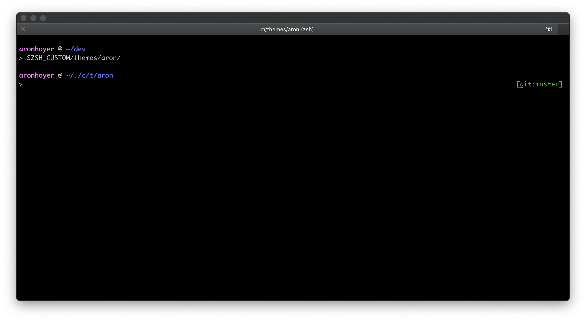

# Personal zsh prompt

Configured almost just how I like it.



## Installation

```sh
curl https://raw.githubusercontent.com/aronhoyer/zsh-theme/master/aron.zsh-theme -o $ZSH_CUSTOM/themes/aronhoyer.zsh-theme
```

## Usage

This theme depends on the `shrink-path` and `git` plugins that comes bundled with oh-my-zsh.

```sh
# Set theme
ZSH_THEME="aron"

# Set plugins
plugins=(
  git
  shrink-path
)

source $ZSH/.oh-my-zsh.sh
```
